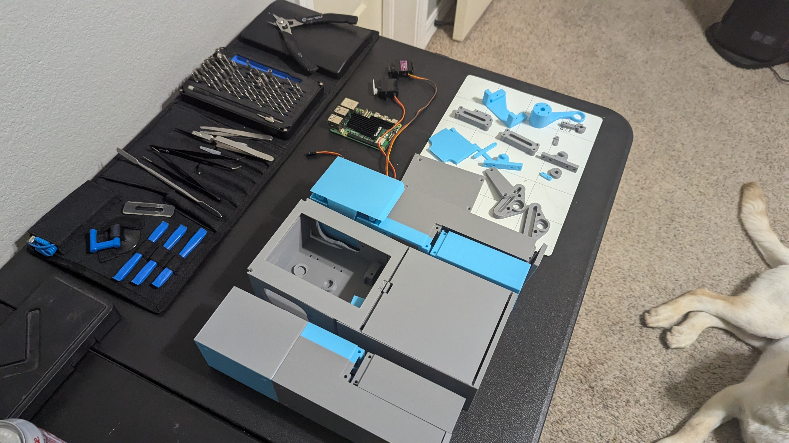

My Modifications and documentation of the build.
All files printed on Bambu Labs P1S
All "Flexor" parts to be printed in TPU, all others PETG

TPU: https://us.store.bambulab.com/products/tpu-for-ams

PETG: https://us.store.bambulab.com/products/petg-hf

The Default v9 chasis bottom does not allow for installation of a SD card, too close to the wall. Modified that part... will test.  (Chassis Bottom (Mod SD CARD).stl)

Plan:
LLM = ooba/openai/tabby (recommend https://github.com/theroyallab/tabbyAPI)
TTS = local or xttsv2 using xtts-api-server WITH VOICE clone (https://github.com/daswer123/xtts-api-server)
STT = uses vosk
SD = Automatic1111
Vision = Image Classifier

Good Info: https://www.instagram.com/wizard.py/

wizard uses the MG996R 55g Digital RC Servo Motors High Torque Metal Gear Servo
Andrew uses: diymore 6PCS Metal Gear High Speed Torque Digital Servo Moto

-Link: https://www.amazon.com/diymore-6-Pack-MG996R-Digital-Helicopter/dp/B0CGRP59HJ/ref=sr_1_5?sr=8-5

Printing Draft / test is complete:

Software Demo (all locally hosted RTX 3060 streaming to RPI):

My Hardware:

Screws Needed (atleast):

6  M3 20mm

40 M3 14mm

76 M3 10mm

Rods:
https://www.amazon.com/gp/product/B01MAYQ12S/ref=ox_sc_act_title_1?smid=ATVPDKIKX0DER&psc=1
https://www.amazon.com/gp/product/B0CTSX8SJS/ref=ox_sc_act_title_2?smid=A1NR50YASSZD11

Servos:
https://www.amazon.com/gp/product/B0CGRP59HJ/ref=ox_sc_act_title_3?smid=A3F3CVCOVVNP2J

NOTE: Each leg APPEARS to need 2 90g micro servos if you want exendable arms.

Bolts:
https://www.amazon.com/gp/product/B0CR6DY4SS/ref=ox_sc_act_title_4?smid=A1ZRRCZIF57JQ9
https://www.amazon.com/gp/product/B0D9GW9K4G/ref=ox_sc_act_title_5?smid=A1ZRRCZIF57JQ9
https://www.amazon.com/gp/product/B0CR6G5XWC/ref=ox_sc_act_title_6?smid=A1ZRRCZIF57JQ9
https://www.amazon.com/gp/product/B0CR6F3N45/ref=ox_sc_act_title_7?smid=A1ZRRCZIF57JQ9

Springs:
https://www.amazon.com/gp/product/B076M6SFFP/ref=ox_sc_act_title_8?smid=A1THAZDOWP300U&psc=1

Bearings:
https://www.amazon.com/gp/product/B07FW26HD4/ref=ox_sc_act_title_9?smid=ATVPDKIKX0DER&psc=1

16-Channel 12-bit PWM Servo Driver with I2C Interface:
https://www.amazon.com/gp/product/B00EIB0U7A/ref=ox_sc_act_title_10?smid=AAEX2EKCSXB7D&psc=1

RPI Mic:
https://www.amazon.com/gp/product/B086DRRP79/ref=ox_sc_act_title_11?smid=A1DWLG2LHSJB8R

Linkage:
https://www.amazon.com/gp/product/B0CRDRWYXW/ref=ox_sc_act_title_12?smid=A1NR50YASSZD11&psc=1

Buck Convertor:
https://www.amazon.com/gp/product/B07SGJSLDL/ref=ox_sc_act_title_13?smid=A3CX4TQNUXMB0L

RPI 5:
https://www.amazon.com/Raspberry-Pi-Quad-core-Cortex-A76-Processor/dp/B0CTQ3BQLS/ref=sr_1_2_sspa?sr=8-2-spons&sp_csd=d2lkZ2V0TmFtZT1zcF9hdGY&psc=1

3" LCD:
https://www.amazon.com/OSOYOO-3-5inch-Display-Protective-Raspberry/dp/B09CD9W6NQ/ref=sr_1_8?sr=8-8

Servo Wires:
https://www.amazon.com/OliYin-7-87in-Quadcopter-Extension-Futaba/dp/B0711TBZY2/ref=sr_1_7?sr=8-7

MISC:

Audio amp:
https://www.amazon.com/dp/B0BTBS5NW2

Audio Speaker:
https://www.amazon.com/dp/B07GJ4GH67

Camera:
https://www.amazon.com/dp/B07GJ4GH67

Orginal Fork info:

# TARS from Interstellar x ChatGPT

- Original article: https://www.hackster.io/charlesdiaz/how-to-build-your-own-replica-of-tars-from-interstellar-224833#comments

## Files TARS v3_10 - Fix Case Clip

- DOWNLOAD: https://uploadnow.io/f/MPLCGwg | https://fastupload.io/9f3621ef4afe07cc

## Software

- Fusion 360 at https://www.autodesk.com/ca-en/products/fusion-360/personal
- https://projects.raspberrypi.org/en/projects/getting-started-with-the-pico/2
- OS Pi: https://www.raspberrypi.com/software/

## Tutorial

- OS SD Card: https://www.tomshardware.com/how-to/set-up-raspberry-pi

### Adafruit 16-Channel PWM HAT with a Raspberry Pi

- Videos https://www.youtube.com/watch?v=bB-xymRI8BY,
- Documentation: https://learn.adafruit.com/adafruit-16-channel-pwm-servo-hat-for-raspberry-pi, https://core-electronics.com.au/guides/raspberry-pi/servo-hat-raspberry-pi/

### Without HAT

- Videos: https://www.youtube.com/watch?v=ea6tSppgZlY, https://www.youtube.com/watch?v=9jcEwn7GzNs, https://www.youtube.com/watch?v=40tZQPd3z8g
- Documentation: https://learn.adafruit.com/adafruits-raspberry-pi-lesson-8-using-a-servo-motor/overview, https://learn.adafruit.com/adafruit-16-channel-servo-driver-with-raspberry-pi/configuring-your-pi-for-i2c, https://www.youtube.com/watch?v=-x2EEIUMm6A

## 3D Printing

- Steel / Stainless / Aluminium: https://forgelabs.ca/
- PLA / ABS: https://jlc3dp.com/3d-printing-quote or https://www.treatstock.com/

## Hardware

#### Power

- 1 x 12V to 6V 3A DC at https://www.aliexpress.com/item/32968137531.html
- https://www.aliexpress.com/item/1005003160082010.html
- 1 x 5V DC 4A Fixed 2.1mm Tip Appliance Plugpack at https://www.amazon.ca/Power-Adapter-100-240V-Transformers-Supply/dp/B087LY41PV/ref=asc_df_B08722QC75/?tag=googleshopc0c-20&linkCode=df0&hvadid=682881027011&hvpos=&hvnetw=g&hvrand=9596795855182106901&hvpone=&hvptwo=&hvqmt=&hvdev=c&hvdvcmdl=&hvlocint=&hvlocphy=9061023&hvtargid=pla-1143272721594&mcid=5e13db627edd3e64951090cd0674e630&gad_source=1&th=1
- 1 x 5V 4A DC Power Adapter at https://www.aliexpress.com/item/1005004589869667.html (Used for testing before buying battery)
- 1 x 5V USB To DC DC Power Cable 5.5\*2.1m at https://www.aliexpress.com/item/1005007296667037.html
- 200000mAh Portable Solar Power Bank External Battery Fast Charging Waterproof Powerbank with SOS Flashlight Poverbank for Xiaomi at https://www.aliexpress.com/item/1005006959367711.html, https://www.aliexpress.com/item/1005007306992861.html

Please use HDMI cable: fpv cable hdmi, HDMI-compatible,FPV HDMI ffc HDMI Ribbon Cable 90 Degree Mini/Micro HDMI to Standard HDMI PCB Connector 20pin fpv micro hdmi 15cm

---

#### Hardware

- 1 x https://www.aliexpress.com/item/32914198349.html

- 2 x Lightweight Actobotics Servo Horn (H25T Spline) at https://www.servocity.com/25t-lightweight-hub-horn/ or look at .step file
- 1 x Adafruit 16-Channel 12-bit PWM/Servo Driver at https://www.adafruit.com/product/2327
- 1 x 8Bitdo Zero 2 Bluetooth at https://www.aliexpress.com/item/1005006458561670.html
-
- 5 x LD-3015MG 17KG 270 (LewanSoul LD-3015MG Standard Full Metal Gear Digital Servo with 17kg High Torque Dual Ball Bearing for RC Robot Car) at https://www.aliexpress.com/item/32787763122.html (2000-0025-0002)
- 1 x Fataba s3003 90-180deg at https://www.aliexpress.com/item/32957714272.html
- 4 x 2903-0004-0245 assembly at https://www.gobilda.com/2903-series-nylon-ball-linkage-m4-24-5mm-length-4-pack / Linkeage Rod M4 at https://www.aliexpress.com/item/1005005616106307.html
- 10 x Flexor bolts at https://www.aliexpress.com/item/32969042589.html

- 10 x Hex M3 20mm, 10 x Hex M3 10mm, 10 x Hex M3 14mm, 10 x Hex M3 30mm at https://www.aliexpress.com/item/1005003184392748.html
- 1 x Bearing 6x15x5 https://www.aliexpress.com/item/4000909583668.html
- 1 x Compression Spring 0.5mmx20mmx11mm https://www.aliexpress.com/item/1005005312536098.html

---

#### CPU & Storage

- 1 x MicroSD Card at https://www.aliexpress.com/item/1005006693506827.html
- 1 x Raspberri 3B/3B+ at https://www.adafruit.com/raspberrypi3bplus or eBay
- 1 x Elecrow 5 inch Touchscreen Portable Monitor HDMI-compatible 800x480 at https://www.aliexpress.com/item/32889893278.html

---

#### Battery

- 1 x myCharge Hub Mini at https://www.target.com/p/mycharge-hub-mini-3350mah-2-4a-output-power-bank-with-integrated-charging-cables-silver/-/A-76625534#lnk=sametab
- 1 x Zeee 11.1V 120C 1500mAh 3S at https://www.amazon.ca/Zeee-Graphene-Quadcopter-Airplane-Helicopter/dp/B08P399N54/

## Extra

- Face Recognition: https://core-electronics.com.au/guides/face-identify-raspberry-pi/
- Lidar Detection: MS200 Lidar Sensor Kit Portable 360°TOF Ranging Scanner 12m Range Support ROS1 and ROS2 For ROS Robot Raspberry Pi Jetson NANO
- Battery Level: https://learn.sparkfun.com/tutorials/ltc4150-coulomb-counter-hookup-guide, https://forums.raspberrypi.com/viewtopic.php?t=173046, https://forums.raspberrypi.com/viewtopic.php?t=340930

## ChatGPT

- https://www.youtube.com/watch?v=N0718RfpuWE

## Servo Abstractor - Python

> Sort of redundant to give these functions their own file, but this program takes the basic servo movements from the servo controller file and combines them to automate walking functions.

## TARS Runner - Python

> Run this file in terminal on your onboard computer to initialize TARS. This file handles communication with the bluetooth remote.

## Servo Controller - Python

> Handles basic movements of servos in TARS. Communicates with an Adafruit PCA9685 servo driver to control the servos.
